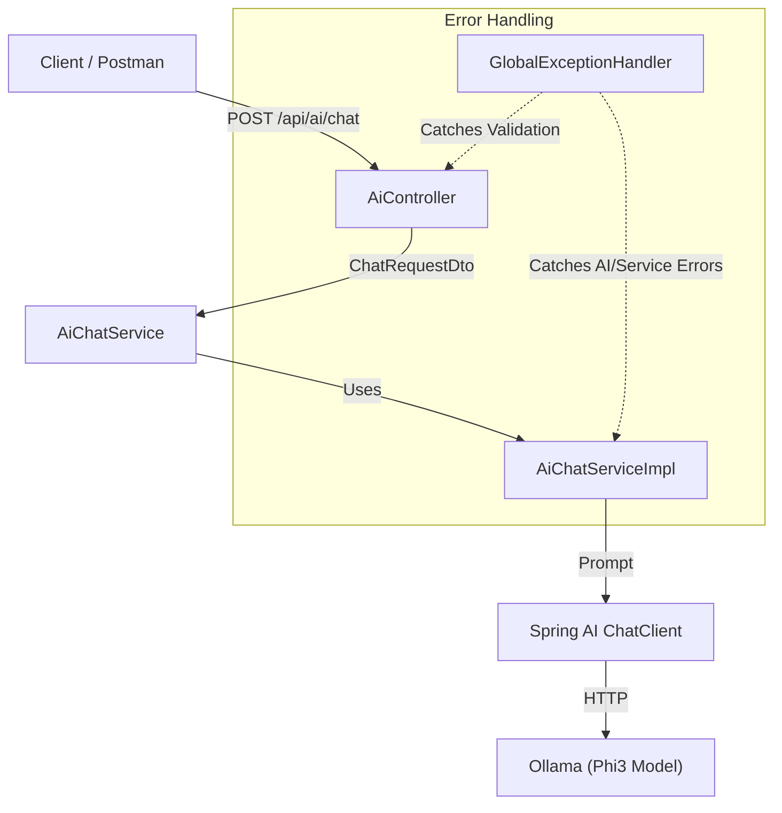

# Spring AI Integration

A Spring Boot backend application demonstrating AI integration using **Spring AI** and the **Ollama Phi3** model. This application exposes a RESTful API for chat interactions, built with clean architecture, proper validation, and robust exception handling.

##  Features

- **AI Integration**: Seamless communication with Ollama (Phi3 model) via Spring AI.
- **REST API**: Exposes a structured POST endpoint for chat interactions.
- **Validation**: Input validation using Spring Validation.
- **Global Error Handling**: Centralized exception handling for clean error responses.
- **Architecture**: Clean controller-service separation with DTOs.
- **Lombok**: Reduced boilerplate code.

##  Architecture

The application follows a layered architecture to ensure separation of concerns.



### Components
1. **AiController**: Handles incoming HTTP requests and validation.
2. **AiChatService**: Interface defining the chat business logic.
3. **AiChatServiceImpl**: Implements the logic, communicates with the `ChatClient`.
4. **ChatClient**: Spring AI client used to interact with the Ollama Phi3 model.
5. **GlobalExceptionHandler**: Centralized error handling for validation, AI errors, and server errors.


##  Technologies Used

- **Java 17**
- **Spring Boot 3.x**
- **Spring AI (Ollama)**
- **Maven**
- **Lombok**

##  Configuration

The application is configured via `application.yaml`.

```yaml
spring:
  ai:
    ollama:
      base-url: http://localhost:11434
      chat:
        model: phi3
```

- **Base URL**: Defaults to `http://localhost:11434` (Ollama default).
- **Model**: Uses `phi3`, but can be switched to other models like `llama3`.

##  Prerequisites

Before running the application, ensure you have the following installed:

1.  **Java 17+**
2.  **Maven**
3.  **Ollama**: You must have Ollama installed and running locally with the `phi3` model.
    ```bash
    ollama run phi3
    ```

##  Getting Started

### 1. Clone the repository
```bash
git clone https://github.com/divyapatil015/spring-ai-integration.git
cd spring-ai-integration
```

### 2. Build the project
```bash
mvn clean install
```

### 3. Run the application
```bash
mvn spring-boot:run
```
The application will start on port `8080` (default).

##  API Documentation

### Chat with AI

**Endpoint:** `POST /api/ai/chat`

**Description:** Sends a user prompt to the AI model and retrieves the generated response.

**Request Headers:**
- `Content-Type: application/json`

**Request Body:**
```json
{
  "prompt": "Tell me a joke about Java programming."
}
```

**Response Body (200 OK):**
```json
{
  "response": "Why do Java developers wear glasses? Because they don't C#!"
}
```

###  Error Responses

**400 Bad Request (Validation Error):**
Occurs when the prompt is empty or missing.
```json
{
  "message": "prompt: Prompt must not be empty",
  "status": 400
}
```

**503 Service Unavailable:**
Occurs when the AI service (Ollama) is down or returns an empty response.
```json
{
  "message": "Service is currently unavailable , Try again after some time",
  "status": 503
}
```

**500 Internal Server Error:**
Generic fallback for unexpected system errors.
```json
{
  "message": "Internal server error",
  "status": 500
}
```
